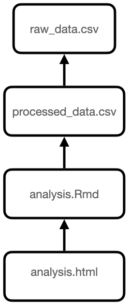
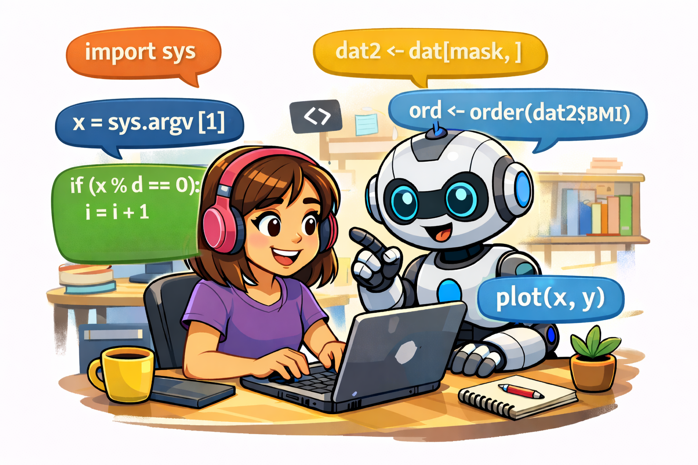

```{r setup, include=FALSE, cache=FALSE}
options(htmltools.dir.version = FALSE, width=80)
knitr::opts_chunk$set(warning = FALSE, message = FALSE, cache=TRUE)

## from http://yihui.name/knitr/hooks#chunk_hooks
knitr::knit_hooks$set(small.mar=function(before, options, envir) {
                                              if (before) par(mar=c(4, 5, 1, 1)) ## smaller margin on top and right
})
```

class: title-slide, middle, center

# Automation and AI pair programming

## Robert Castelo
[robert.castelo@upf.edu](mailto:robert.castelo@upf.edu)
### Dept. of Medicine and Life Sciences
### Universitat Pompeu Fabra

<br>

## Fundamentals of Computational Biology
### BSc in Biomedical Sciences
### UPF School of Medicine and Life Sciences
### Academic Year 2025-2026

---
class: center, middle, inverse

# Automation

---

## Why should we _automate_ data analysis?

.left-column[
* Data analysis can be done in a myriad number of ways.  
  &nbsp;&nbsp;
* As important as choosing the right way to analyse data, is to be able to
  *re-run* the analysis in different ways.  
  &nbsp;&nbsp;
* Re-running data analyses is essential for enabling reproducibility.  
  &nbsp;&nbsp;
* _Manual and interactive intervention_ during data analysis introduces cost
  in *re-running* it and compromises its reproducibility.  
  &nbsp;&nbsp;
* To facilitate re-running data analyses we need to **automatize** them.
]
.right-column[
<p style="margin-top:-20px">


]

.footer[
Top image from [xkcd](https://xkcd.com/1319), bottom image from Brian Schilder
at [GitHub](https://github.com/neurogenomics/rworkflows/discussions/93).
]

---

## Data analysis pipelines

.left-column[
* A data analysis pipeline is a chain of data analysis steps including,
but not limited to:
  * Downloading/acquiring data.  
    &nbsp;&nbsp;
  * Extracting/transforming data.  
    &nbsp;&nbsp;
  * Cleaning data.  
    &nbsp;&nbsp;
  * Standardizing data.  
    &nbsp;&nbsp;
  * Exploring/summarizing data.  
    &nbsp;&nbsp;
  * Modeling data.  
    &nbsp;&nbsp;
  * Reporting results.
]
.right-column[

]

---

## Make and Makefiles

* In the context of software development, certain programming languages
  such as Fortran, C or C++, require their source code to be
  [_compiled_](https://en.wikipedia.org/wiki/Compiler) to obtain an
  [executable program](https://en.wikipedia.org/wiki/Executable).  
  &nbsp;&nbsp;
* One single executable could be the result of _compiling_ multiple files
  of source code with many, often intrincate, dependencies among them.  
  &nbsp;&nbsp;
* In that context, [Stuart Feldman](https://en.wikipedia.org/wiki/Stuart_Feldman),
  a researcher at Bell Labs, developed in 1976 a program called
  [_make_](https://en.wikipedia.org/wiki/Make_%28software%29), which executed
  the compiling instructions in the required order, according to a set of rules
  described in a text file called a
  [_Makefile_](https://en.wikipedia.org/wiki/Makefile).  
  &nbsp;&nbsp;
* The software _make_ and _Makefiles_ are still nowadays intensively used in
  software development to automate the process of producing a single executable
  program from a set of source code files.  
  &nbsp;&nbsp;
* Likewise, _make_ and _Makefiles_ can be used to automate data analysis
  pipelines; see the blog post ["Why Use Make"](https://bost.ocks.org/mike/make)
  by [Mike Bostock](https://en.wikipedia.org/wiki/Mike_Bostock), former head of
  data-visualization projects at the New York Times and current CTO at
  [Observable](https://observablehq.com).

---

## Make and Makefiles

* To work with _make_ and _Makefiles_ you need first to identify which are
the dependencies among your files, and then express those dependencies
_backwards_ as rules in a file called **`Makefile`** using a specific syntax.

.left-column[

<pre style="font-size:80%; margin-left:20px;">
all : analysis.html

analysis.html : analysis.Rmd processed_data.csv
     Rscript -e 'rmarkdown::render("analysis.Rmd")'

processed_data.csv : raw_data.csv
     python process_data.py raw_data.csv
</pre>

* Finally, to run _make_ according to the rules given in the _Makefile_
you need to type in the Unix shell:

<pre style="font-size:80%; margin-left:20px;">
$ make
</pre>

* The software _make_ will look up what files have _changed_
and trigger the corresponding rule, accordingly.
]
.right-column[
<p style="margin-left:100px;">

]

---

## Make and Makefiles

* The syntax in a _Makefile_ is the following:
<pre>
all : target-file
&nbsp;&nbsp;
target-file : prerequisites
<--TAB--> action-command-to-produce-the-target-file
</pre>
* Note that **there is a TAB character** before the _action command_
  associated to a rule. Single spaces **will not work**, you really need to
  put a TAB character.  
  &nbsp;&nbsp;
* The `all` rule may have more than one file as prerequisite and is the
  rule that _make_ will first look up. However, you can also call make with
  a `target-file` as argument, and will only execute the rules to obtain
  that target, e.g.:
<pre>
$ make target-file
</pre>
* There are additional ways to express rules, such as when having a large
  quantity of target files and want to avoid writing a rule for each of them.
  You can find a more comprehensive tutorial by
  [Karl Broman](https://www.biostat.wisc.edu/staff/broman-karl)
  [here](https://kbroman.org/minimal_make).

---

## Concluding remarks

* _make_ and _Makefiles_ can help us automating our data analysis pipeline.  
&nbsp;&nbsp;
* You can find further materials on using _make_ and _Makefiles_ in this
[automation chapter](https://stat545.com/automation-overview.html) from a
course on data science by
[Jenny Bryan](https://jennybryan.org) and in this
[workshop material](https://swcarpentry.github.io/make-novice) by
[The Software Carpentry](https://software-carpentry.org).  
&nbsp;&nbsp;
* Further topics on automation that we have not covered here are:
  * [Unit testing](https://en.wikipedia.org/wiki/Unit_testing) for
  automatically checking that our pipeline behaves as expected. In
  Python we have the module
  [pytest](https://docs.pytest.org/en/stable/getting-started.html)
  for that purpose, while in R we have the packages
  [RUnit](https://cran.r-project.org/web/packages/RUnit/index.html)
  and
  [testthat](https://testthat.r-lib.org).  
  &nbsp;&nbsp;
  * [Continuous integration (CI)](https://en.wikipedia.org/wiki/Continuous_integration)
  for triggering automated unit tests each time we update our pipeline. Some
  of the most widely used CI environments are
  [Travis CI](https://travis-ci.com) and
  [GitHub Actions](https://github.com/features/actions).

---
class: center, middle, inverse

# AI pair programming

---

## What is pair programming?

.pull-left[
* [Pair programming](https://en.wikipedia.org/wiki/Pair_programming)
  is a coding approach in which two persons work
  side-by-side programming code on the same computer.  
  &nbsp;&nbsp;
* One, called the "driver", writes code while the other, called
  the "observer" or "navigator", reviews each line of code as it is typed in by
  the "driver".
]
.pull-right[
<p style="margin-top:50px;">

]

* The observer/navigator detects errors, makes suggestions, and thinks strategically
  about the direction of the work, but the two persons switch roles frequently,
  so that both of them have the opportunity to write code and review it.  
  &nbsp;&nbsp;
* Pair programming can help to improve code quality, facilitate knowledge
  sharing, and enhance team collaboration. It can also be a valuable learning
  experience for both driver and observer, as they can learn from each
  other's skills.

.footer[
Image from [On Pair Programming](https://martinfowler.com/articles/on-pair-programming.html) by Birgitta Böckeler and Nina Siessegger.
]

---

## What is AI pair programming?

.pull-left[
* It is a new, evolved form of pair programming in which an
  AI-powered 24/7 coding assistant helps a human programmer to write code.  
  &nbsp;&nbsp;
* The AI-powered assistant can be a large language model (LLM) such as
  [ChatGPT](https://chat.openai.com) or
  [Gemini](https://gemini.google.com), trained on a large corpus of
  programming code and documentation.
]
.pull-right[
<p style="margin-top:50px;">

]

* The human programmer can interact with the AI assistant by asking questions,
  giving instructions, or providing feedback on the generated code.  
  &nbsp;&nbsp;
* The AI assistant can help the human programmer by suggesting code snippets,
  explaining concepts, debugging code, or even writing entire functions or
  scripts based on the human's instructions.

.footer[
Image generated by ChatGPT.
]

---

## What is GitHub Copilot?

* [GitHub Copilot](https://github.com/copilot) is an AI-powered coding assistant
  developed by GitHub in collaboration with [OpenAI](https://openai.com).  
  &nbsp;&nbsp;
* It is powered by OpenAI's [generative pre-trained transformer (GPT)](https://en.wikipedia.org/wiki/Generative_pre-trained_transformer)
  model [ChatGPT-Codex](https://chatgpt.com/codex),
  an LLM trained on the vast corpus of public code repositories available at
  GitHub and natural language text.  
  &nbsp;&nbsp;
* GitHub Copilot is designed to assist programmers by providing code suggestions
  and autocompletions as they write code in their integrated development
  environment (IDE). It can generate code snippets, complete lines of code, and
  even suggest entire functions based on the context of the code being written.  
  &nbsp;&nbsp;
* GitHub Copilot supports multiple programming languages and can be used in
  various IDEs, including
  [Visual Studio Code](https://code.visualstudio.com),
  [Vim](https://www.vim.org)/[Neovim](https://neovim.io),
  and [JetBrains](https://www.jetbrains.com) IDEs.

---

## What is GitHub Copilot?

* The
  [main features of GitHub Copilot](https://docs.github.com/en/copilot/get-started/what-is-github-copilot)
  are:
  * Code suggestions and autocompletions based on the context of the code being
    written.  
    &nbsp;&nbsp;
  * Chat with Copilot to get help with your code.  
    &nbsp;&nbsp;
  * Integration with popular IDEs, allowing programmers to receive code
    suggestions in real-time as they write code.  
    &nbsp;&nbsp;
  * The ability to learn from user feedback, improving its suggestions over time
    based on the user's coding style and preferences.  
    &nbsp;&nbsp;
  * Support for multiple programming languages, such as Python, R, JavaScript,
    C, C++, etc., making it a versatile tool for programmers working in
    different languages and frameworks.

---

## What is GitHub Copilot?

* The main differences between GitHub Copilot and other general-purpose LLMs
  such as ChatGPT or Gemini are:
  * GitHub Copilot is specifically trained on a large corpus of public code
    repositories and programming-related text, while ChatGPT and Gemini are
    trained on a more general corpus of natural language text.  
    &nbsp;&nbsp;
  * GitHub Copilot is specifically designed for coding tasks, while ChatGPT
    and Gemini are more general-purpose LLMs that can be used for a wide range
    of natural language processing tasks.  
    &nbsp;&nbsp;
  * GitHub Copilot is integrated into popular IDEs, allowing programmers to
    receive code suggestions in real-time as they write code, while ChatGPT
    or Gemini typically require users to interact with them through a web
    interface or standalone applications.

---

## How to set up GitHub Copilot?

* To use GitHub Copilot, you need to have a GitHub account with access to a
  Copilot plan, and a compatible IDE such as VS Code, Vim/Neovim, or JetBrains,
  and follow the steps below:
  1. First, you should sign up for a GitHub
     [Copilot plan](https://docs.github.com/en/copilot/get-started/plans).  
     &nbsp;&nbsp;
  2. Second, you should install a GitHub Copilot extension or plugin in your IDE,
     following the instructions provided at this
     [link](https://docs.github.com/en/copilot/how-tos/set-up/install-copilot-extension).  
     &nbsp;&nbsp;
  3. Third, you need to authorise your IDE to access your GitHub account and
     enable GitHub Copilot.

---

## How to use GitHub Copilot?

* Writing code as you normally would, and GitHub Copilot will provide
  suggestions and autocompletions based on the context of the code being
  written.  
  &nbsp;&nbsp;
* Specific prompts can be provided to GitHub Copilot by writing comments in
  your code.  
  &nbsp;&nbsp;
* You can also ask GitHub Copilot questions or give it instructions by typing
  in the chat interface, and it will respond with code suggestions or
  explanations.  
  &nbsp;&nbsp;
* You can provide feedback on the suggestions made by GitHub Copilot, which
  will help it to learn and improve its suggestions over time based on your
  coding style and preferences.

---

## Giving context to GitHub Copilot

* To get the best suggestions from GitHub Copilot, it is important to provide
  it with as much context as possible about the code you are writing.  
  &nbsp;&nbsp;
* Next to the comments you write in your code, you can customize Copilot's
  suggestions by giving it
  [specific instructions](https://docs.github.com/en/copilot/how-tos/configure-custom-instructions/add-repository-instructions)
  in a markdown file called `copilot-instructions.md` in the root of your project.  
  &nbsp;&nbsp;
* You may have a user profile wide `copilot-instructions.md` file in your home
  directory, which will be used as default instructions for all your projects,
  or you can have project-specific `copilot-instructions.md` files in the root of
  each of your projects, which will override the default instructions for that
  project.  
  &nbsp;&nbsp;
* The easiest way to start a `copilot-instructions.md` file is to type in the
  chat interface the following prompt:
  <pre>
  /init copilot-instructions.md
  </pre>
  followed by the instructions you want to give to GitHub Copilot, and it will
  create the file for you with the instructions you have given it.

---

## Concluding remarks

.pull-left[
* AI pair programming with tools such as
  [GitHub Copilot](https://github.com/features/copilot) can help you writing
  code more efficiently, improve code quality, and enhance your learning
  experience, helping you to keep the dev flow.  
]
.pull-right[
<p style="margin-top:0px;">

]

* GitHub Copilot responses are non-deterministic, that is, the same prompt
  may yield different suggestions at different times and by different users,
  and it can also generate code that is syntactically correct but does not
  solve the problem at hand.  
  &nbsp;&nbsp;
* It is important to use AI pair programming tools responsibly and
  critically, as they may not always provide accurate or optimal code suggestions,
  and may also raise ethical and security concerns related to code generation and
  intellectual property.  
  &nbsp;&nbsp;
* To best use AI pair programming tools you need to provide as much context
  as possible and learn doing good
  [prompt engineering](https://en.wikipedia.org/wiki/Prompt_engineering),
  which is the art of crafting effective prompts to elicit useful and accurate
  responses from AI models.
